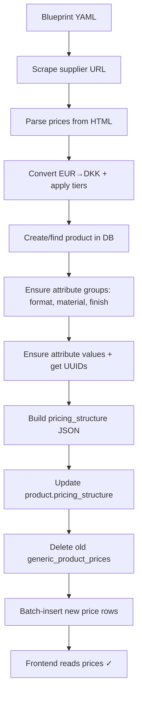

# Fetch Skill

Fetch supplier pricing data from an external URL, create or update a product with its attributes, and publish prices into the Webprinter backend.

## When to Use

- Importing prices from a supplier website (scraped HTML, `<ul>` lists, tables, etc.)
- Creating a new product from a blueprint YAML
- Bulk-publishing prices to `generic_product_prices` while correctly setting `pricing_structure`

---

## 1) Product & Attribute Setup

### Database Tables

| Table | Purpose |
|---|---|
| `products` | Product record; holds `pricing_structure` JSONB and `pricing_type` |
| `product_attribute_groups` | Groups per product: kind = `format`, `material`, `finish`, `other`, `custom` |
| `product_attribute_values` | Values within groups; formats carry `width_mm`/`height_mm` |
| `generic_product_prices` | Final published price rows read by the storefront |

### Creating a Product

Insert into `products` with:
- `tenant_id`, `name`, `slug`, `description`, `category`
- `pricing_type: 'matrix'`
- `pricing_structure`: see section 3 below

### Provisioning Attribute Groups

For each attribute kind needed (format, material, finish):

```sql
INSERT INTO product_attribute_groups
  (product_id, tenant_id, name, kind, ui_mode, sort_order, enabled, source)
VALUES
  (:product_id, :tenant_id, 'Format', 'format', 'buttons', 0, true, 'product');
```

### Provisioning Attribute Values

For each value within a group:

```sql
INSERT INTO product_attribute_values
  (group_id, product_id, tenant_id, name, sort_order, enabled, width_mm, height_mm, meta)
VALUES
  (:group_id, :product_id, :tenant_id, 'A4', 0, true, 210, 297, NULL);
```

> [!IMPORTANT]
> Attribute value UUIDs are used everywhere: in `pricing_structure.vertical_axis.valueIds`, in `layout_rows[].columns[].valueIds`, and in `generic_product_prices.variant_value` / `extra_data.selectionMap`.

---

## 2) Vertical Axis (Rows of the Price Matrix)

The **vertical axis** determines what appears as **rows** in the price table on the frontend.

- **Materials as vertical** (most common): each material is a row; formats/finishes are columns/selectors.
- **Formats as vertical**: each format is a row; materials/finishes are columns/selectors.

The blueprint YAML field `matrix.vertical_axis` sets this:

```yaml
matrix:
  vertical_axis: "materials"   # or "formats"
```

This maps to `pricing_structure.vertical_axis.sectionType` = `'materials'` or `'formats'`.

---

## 3) Pricing Structure (stored on `products.pricing_structure`)

The full `MatrixLayoutV1` structure:

```jsonc
{
  "mode": "matrix_layout_v1",
  "version": 1,
  "vertical_axis": {
    "sectionId": "vertical-axis",
    "sectionType": "materials",        // or "formats"
    "groupId": "<material_group_uuid>",
    "valueIds": ["<mat_val_1>", "<mat_val_2>"],
    "ui_mode": "buttons",
    "title": "Materiale",
    "description": ""
  },
  "layout_rows": [
    {
      "id": "row-1",
      "title": "",
      "columns": [
        {
          "id": "format-section",
          "sectionType": "formats",
          "groupId": "<format_group_uuid>",
          "valueIds": ["<fmt_val_1>", "<fmt_val_2>"],
          "ui_mode": "buttons",
          "selection_mode": "required",
          "title": "Format"
        },
        {
          "id": "finish-section",          // optional
          "sectionType": "finishes",
          "groupId": "<finish_group_uuid>",
          "valueIds": ["<fin_val_1>"],
          "ui_mode": "buttons",
          "selection_mode": "optional",
          "title": "Efterbehandling"
        }
      ]
    }
  ],
  "quantities": [100, 250, 500, 1000]
}
```

Update the product:

```ts
await supabase
  .from('products')
  .update({ pricing_structure, pricing_type: 'matrix' })
  .eq('id', productId);
```

---

## 4) Publishing Prices to `generic_product_prices`

### Price Row Schema

Each row in `generic_product_prices`:

| Column | Value |
|---|---|
| `product_id` | Product UUID |
| `tenant_id` | Tenant UUID |
| `variant_name` | Sorted non-vertical value IDs joined with `\|` (e.g., `<formatId>` or `<formatId>\|<finishId>`) |
| `variant_value` | Vertical axis value UUID (e.g., materialId) |
| `quantity` | Integer quantity |
| `price_dkk` | Integer price in DKK |
| `extra_data` | JSONB with `selectionMap`, `formatId`, `materialId`, etc. |

### `extra_data` Shape

```jsonc
{
  "verticalAxisGroupId": "<material_group_uuid>",
  "verticalAxisValueId": "<material_value_uuid>",
  "formatId": "<format_value_uuid>",
  "materialId": "<material_value_uuid>",
  "selectionMap": {
    "format": "<format_value_uuid>",
    "material": "<material_value_uuid>",
    "variant": "<finish_value_uuid>"     // only if finish exists
  }
}
```

### Publish Steps

1. **Delete** existing prices for the product:
   ```ts
   await supabase.from('generic_product_prices').delete().eq('product_id', productId);
   ```

2. **Batch-insert** new rows (500 per batch):
   ```ts
   for (let i = 0; i < rows.length; i += 500) {
     await supabase.from('generic_product_prices').insert(rows.slice(i, i + 500));
   }
   ```

---

## 5) Scraping Supplier Prices

Use Firecrawl or Playwright to fetch pricing tables from the supplier URL.

### Blueprint Config

```yaml
pricing_import:
  type: "ul_prices"
  url: "https://supplier.example.com/product"
  ul_selector: "ul.price-matrix"
  eur_to_dkk: 7.5
  rounding_step: 1
  tiers:
    - max_dkk_base: 2000
      multiplier: 1.6
    - max_dkk_base: 5000
      multiplier: 1.5
    - multiplier: 1.3
```

### Price Conversion

1. Scrape raw prices from the supplier page.
2. Convert EUR → DKK using `eur_to_dkk` rate.
3. Apply markup tiers based on the base DKK price.
4. Round to `rounding_step`.

---

## 6) End-to-End Workflow



---

## 7) Key Files

| File | Role |
|---|---|
| [pricingStructure.ts](file:///Users/cookabelly/Documents/Antigravity%20stuff/printmaker-web-craft-main/src/types/pricingStructure.ts) | Canonical types: `MatrixLayoutV1`, `VerticalAxisConfig`, `GenericProductPriceRow` |
| [PublishDialog.tsx](file:///Users/cookabelly/Documents/Antigravity%20stuff/printmaker-web-craft-main/src/components/admin/pricing-hub/PublishDialog.tsx) | Reference implementation for the publish flow |
| [PRICING_SYSTEM.md](file:///Users/cookabelly/Documents/Antigravity%20stuff/printmaker-web-craft-main/docs/PRICING_SYSTEM.md) | System documentation |
| [PRICING_HUB_CSV_IMPORT_REQUIREMENTS.md](file:///Users/cookabelly/Documents/Antigravity%20stuff/printmaker-web-craft-main/docs/PRICING_HUB_CSV_IMPORT_REQUIREMENTS.md) | CSV import contract & operator workflow |
| [fetch-master-webprinter.yml](file:///Users/cookabelly/Documents/Antigravity%20stuff/printmaker-web-craft-main/blueprints/fetch-master-webprinter.yml) | Example blueprint |
| [20260108100000_attribute_builder.sql](file:///Users/cookabelly/Documents/Antigravity%20stuff/printmaker-web-craft-main/supabase/migrations/20260108100000_attribute_builder.sql) | Attribute tables schema |
