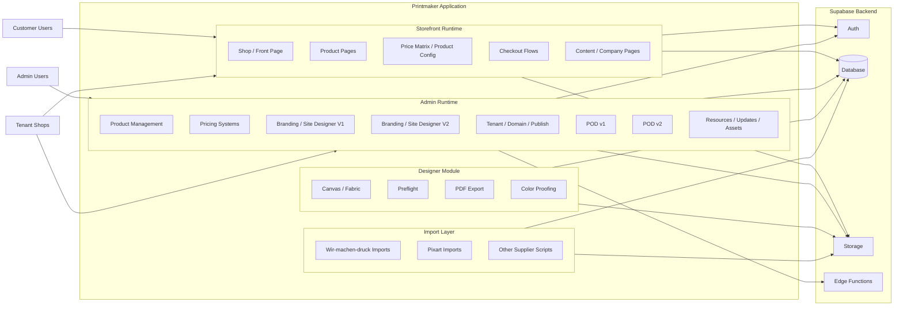
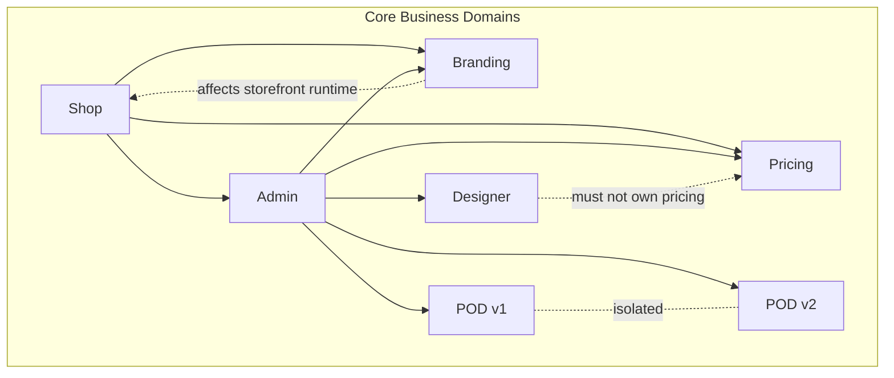
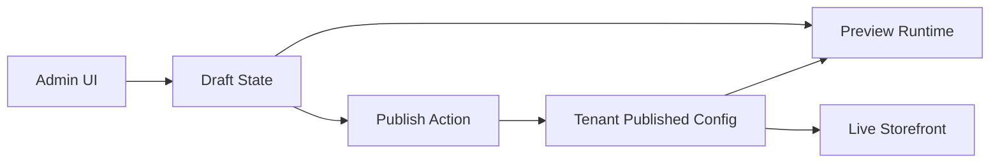
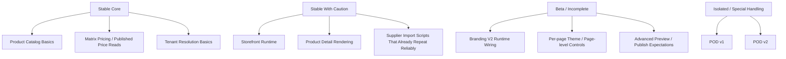
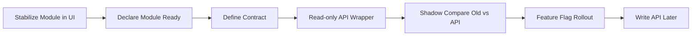
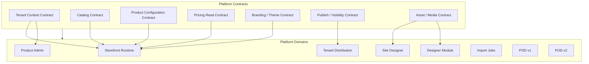

# Visual System Map

Status: Working architecture snapshot  
Purpose: Show the current platform shape, major boundaries, and the safest API-hardening path.

For a simpler plain-language guide, see `docs/DOMAIN_STABILITY_MAP.md`.

This map is based on:

- `README.md`
- `PROJECT_STATUS.md`
- `docs/ARCHITECTURE_BOUNDARIES.md`
- `docs/REST_API_READINESS_DRAFT.md`
- `docs/SITE_DESIGN_V2_STATUS.md`
- `docs/PRICING_SYSTEM.md`
- `src/App.tsx`
- `src/pages/Admin.tsx`

---

## 1. Platform Overview

---

## 2. Domain Boundaries

Notes:

- `Pricing` is one of the strongest structured domains and should be treated as core.
- `Branding / Site Designer V2` exists, but the runtime wiring is not fully complete end-to-end.
- `POD v1` and `POD v2` must remain isolated.

---

## 3. Runtime Data Shape

This is especially important for:

- branding / site designer
- product visibility / publish behavior
- tenant-specific copies vs master-controlled flows

---

## 4. Stability Map

---

## 5. Where API Hardening Should Start

Recommended order:

1. Site Designer read
2. Catalog read
3. Product detail/options read
4. Pricing read
5. Branding/theme read
6. Admin writes
7. Tenant publish/sync
8. Design module
9. Import/integration jobs

---

## 6. Target Architecture

The practical goal is simple:

- UI changes should not redefine business rules.
- Data contracts should outlive UI experiments.
- Experimental systems should not sit on the same operational level as stable runtime paths.

---

## 7. Immediate Recommendation

Before major API work:

1. Freeze the domain map.
2. Mark each domain as `stable`, `beta`, or `experimental`.
3. Define the first 5 read contracts.
4. Add regression checks for pricing and tenant publish behavior.
5. Keep V1 runtime safe while V2/theme work matures behind a clearer boundary.
